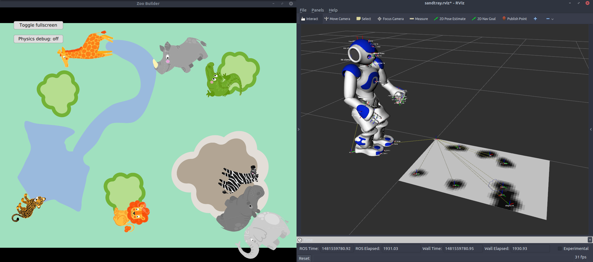

Playground Builder -- ROS interface & autonomous play behaviour
===============================================================

*This is the sister repository to [the QtQuick-based
GUI](https://github.com/severin-lemaignan/playground-builder-qt) of the
'Playground Builder' experimental framework for Cognitive Human-Robot
Interaction research.*



This repository contains the most of the ROS code for the 'Playground Builder'
experimental framework for HRI.


Installation
------------

As usual:

```
> git clone https://github.com/severin-lemaignan/playground-builder-ros.git
> cd playground-builder-ros
> mkdir build && cd build
> cmake ..
> make install
```

Usage
-----

To get the robot to play and build/arrange the playground by itself:

- Start the GUI (from QtCreator for instance)
- `roslaunch playground-builder-ros play.launch`

...in whichever order you prefer...

*Currently, the nodes do not expose any particular options.*

Nodes documentation
-------------------

The repository currently contains 3 nodes: `playground_map_and_plan`,
`move_playground_items` and `play`.

### playground_map_and_plan

`playground_map_and_plan` first wait for the shapes of everything single
playground items to be published as marker arrays. By default, listen to the
`/footprints` topic.

After this initial step, it listen over ROS TF for the position of each of the
items, and generate an occupancy map. **Note that the size and resolution of the
map is currently hard-coded to 60x33.5cm, 5cm per cell**.

It then exposes a planning service (`plan_motion`) that uses the A\*
algorithm to plan a path to move an item from A to B.
Upon completion the resulting path is as well published on
the `/playground_manipulation_path` topic, for visualisation in RViz.


### move_playground_items

This nodes exposes a ROS action server (`move_playground_items`) that waits for
a goal (item name, target position), calls the planner, and 'executes' the
motion by publishing a sequence of ROS poses corresponding to virtual touches of
the robot on the surface of the GUI, causing the robot to actually move items
around.

### play

This node actually encodes the play strategy for the robot. Currently, the
following behaviour is hard-coded for the 'Zoo' environment:

at each step,
    - either move one animal to its habitat
    - or one block onto the border of one of the enclosure

Animals and blocks are picked up only if they are in (virtual) arm reach, and
the closest animals/blocks are always prefered.
